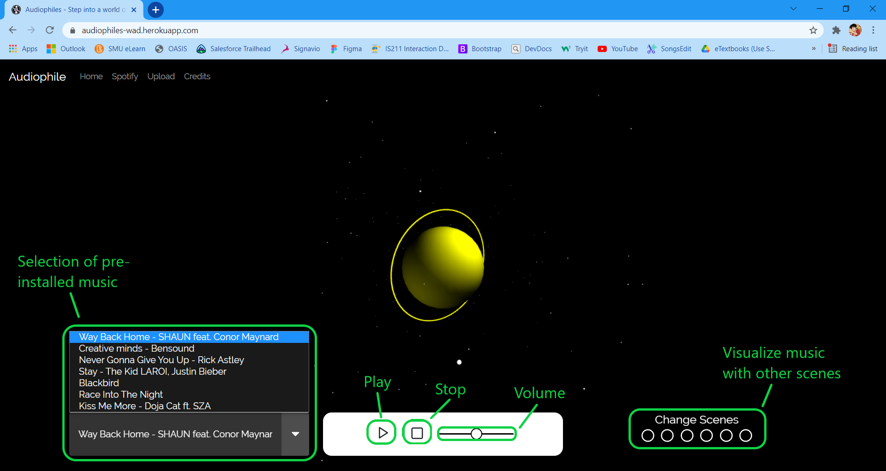

<div id="top"></div>

<!-- PROJECT LOGO -->
<br />
<div align="center">
  <a href="https://github.com/github_username/repo_name">
    
  </a>

<h3 align="center">Audiophiles</h3>

  <p align="center">
    <i>IS216 Web Application Development 2 Project for Singapore Management University</i>
    <br />
    Audiophiles is a digital audio streaming and media provider, which gives users an immersive 3D audio and visual experience with all genres of music. It inherently allows users to upload and listen to music that they have created as well as from their own Spotify Playlists. 
    <br />
    The team would like users to relive the days of owning their own Hi-fi system where you could watch the movement of the music’s soundwaves, but in a manner where it's interactive and curated to their own music playlist.
    <br />
    <a href="https://github.com/Vasn/wad-g8"><strong>Explore the docs »</strong></a>
    <br />
    <br />
    <a href="https://audiophiles-wad.herokuapp.com/">View Demo</a>
    ·
    <a href="https://github.com/Vasn/wad-g8/issues">Report Bug</a>
    ·
    <a href="https://github.com/Vasn/wad-g8/issues">Request Feature</a>
  </p>
</div>


<!-- TABLE OF CONTENTS -->
<details>
  <summary>Table of Contents</summary>
  <ol>
    <li>
      <a href="#about-the-project">About The Project</a>
      <ul>
        <li><a href="#built-with">Built With</a></li>
      </ul>
    </li>
    <li>
      <a href="#getting-started">Getting Started</a>
      <ul>
        <li><a href="#prerequisites">Prerequisites</a></li>
        <li><a href="#installation">Installation</a></li>
      </ul>
    </li>
    <li><a href="#usage">Usage</a></li>
    <li><a href="#roadmap">Roadmap</a></li>
    <li><a href="#contact">Contact</a></li>
  </ol>
</details>


<!-- ABOUT THE PROJECT -->
## About The Project

[![Product Name Screen Shot][product-screenshot]](https://audiophiles-wad.herokuapp.com/)

<p align="right">(<a href="#top">back to top</a>)</p>


### Built With

* [Bootstrap](https://getbootstrap.com/)
* [Three.js](https://threejs.org/)
* [Vue.js](https://vuejs.org/)
* [Firebase](https://firebase.google.com/)
* [Spotify Web API](https://developer.spotify.com/documentation/web-api/)
* [Spotify Web Playback SDK](https://developer.spotify.com/documentation/web-playback-sdk/)
* [Web Audio API](https://developer.mozilla.org/en-US/docs/Web/API/Web_Audio_API)
* [Heroku](https://www.heroku.com/)
* [Blender](https://www.blender.org/)
* [Figuro](https://figuro.io/Home/Welcome)
* [Mixamo](https://www.mixamo.com/#/)


<p align="right">(<a href="#top">back to top</a>)</p>


<!-- GETTING STARTED -->
## Getting Started

To get a local copy up and running follow these simple example steps.

### Prerequisites

* Spotify Premium Account
* Spotify Developer Account
* Firebase Google Account

### Installation

1. Clone the repo / Download (Code > Download ZIP)
   ```sh
   git clone https://github.com/Vasn/wad-g8.git
   ```
2. Open scripts/app.js, replace the redirect URI variable with the location of your spotify.html (without the .html) in your web root
   ```sh
   var redirect_uri = "http://localhost/wad-g8/spotify.html";
   ```
2. Open WAMP/MAMP with folder in web directory and open in browser
   ```sh
   http://localhost/is216/wad-g8/
   ```
4. Done!

<p align="right">(<a href="#top">back to top</a>)</p>


<!-- USAGE EXAMPLES -->
## Usage
- Home
    - Loaded with pre-installed music to play and visualize</br>
    
- Spotify
    - Login to Spotify
        - Play all your favourite hot hits from your Spotify library
- Upload
    - Register and login with your Audiophile Account
        - Upload mp3 files by drag and drop
            - Play your favourite music locally
- Credits
    - Control dancing character with arrow keys in a virtual dimension

According to Spotify, there is over 1,300 different music genres. While music genres continue to grow, the way that we listen to music has been less immersive. Today's act of listening to music does not involve much interaction or visualization as it did in the past with an old windows media player or a hi-fi system. Taking the concept of old audio visualisers, we have created a web application that allows users to interact with 3D visuals that move and change according to the varying beats and frequencies of the playing song. After further brainstorming, we decided to integrate Spotify into our application as it is a widely recognised music streaming platform. With Spotify integration and the option to upload their own mp3 files, the music that users can choose to play is endless.

<p align="right">(<a href="#top">back to top</a>)</p>


<!-- ROADMAP -->
## Development Roadmap (from top to bottom)
- [X] Learning Three.js / APIs / Firebase
- [X] 3d Scene #1
- [X] 3d Scene #2
- [X] Spotify API
    - [X] Spotify Login
    - [X] Spotify API Call
- [X] 3d Scene #3
- [X] 3d Scene #4
- [X] Spotify API
    - [X] Music Controls
    - [X] Progress Bars
- [X] 3d Scene #5
- [X] 3d Scene #6
- [X] Navigation Bar
    - [X] Content Structuring
    - [X] Navbar Design
    - [X] Navbar Component
- [X] Music Controls
    - [X] Play/Pause
    - [X] Stop
    - [X] Volume Scrubber
    - [X] Vue.Js Functions and Data
- [X] Music Dropdown
- [X] Scene Change Controls
    - [X] Vue.js Functions and Data
    - [X] Scene Integration into One Camera and One Renderer
    - [X] Scene Animations
- [X] Audio Analyzer
- [X] Spotify Page Integration
    - [X] Audio Analyser API call Data Manipulation
    - [X] Scene Animations
- [X] Home Mobile Responsiveness
- [X] Spotify Mobile Responsiveness
- [X] Three.js Scene Mobile Responsiveness
- [X] Firebase
    - [X] User Authentication (Register/Login)
    - [X] Realtime Database
    - [X] Blob Storage
- [X] Upload Page Integration
    - [X] Merge with Scenes
    - [X] Merge with Dropdown list
    - [X] Merge with Audio Analyzer
- [X] Credits Scene
    - [X] Design
    - [X] Modeling
    - [X] Integrating with Three.js
    - [X] Navbar Integration
- [X] Debugging
- [X] Heroku Deployment


<p align="right">(<a href="#top">back to top</a>)</p>


<!-- CONTACT -->
## Contact

Vasilis - [@vasnjq](https://www.instagram.com/vasnjq/) - vasilis.ng.2020@scis.smu.edu.sg</br>
Shya - [@shyatup](https://www.instagram.com/shyatup/) - swquah.2020@scis.smu.edu.sg</br>
Jacky - [@jackyteojianqi](https://www.instagram.com/jackyteojianqi/) - jacky.teo.2020@scis.smu.edu.sg</br>
Jun Hui - [@junhuixp](https://www.instagram.com/junhuixp/) - junhui.lee.2020@scis.smu.edu.sg</br>
Erlynne - [@erlynnehazey](https://www.instagram.com/erlynnehazey/) - erlynneong.2020@scis.smu.edu.sg</br>

Project Link: [https://github.com/Vasn/wad-g8](https://github.com/Vasn/wad-g8)

<p align="right">(<a href="#top">back to top</a>)</p>


[product-screenshot]: assets/indexscreenshot.png